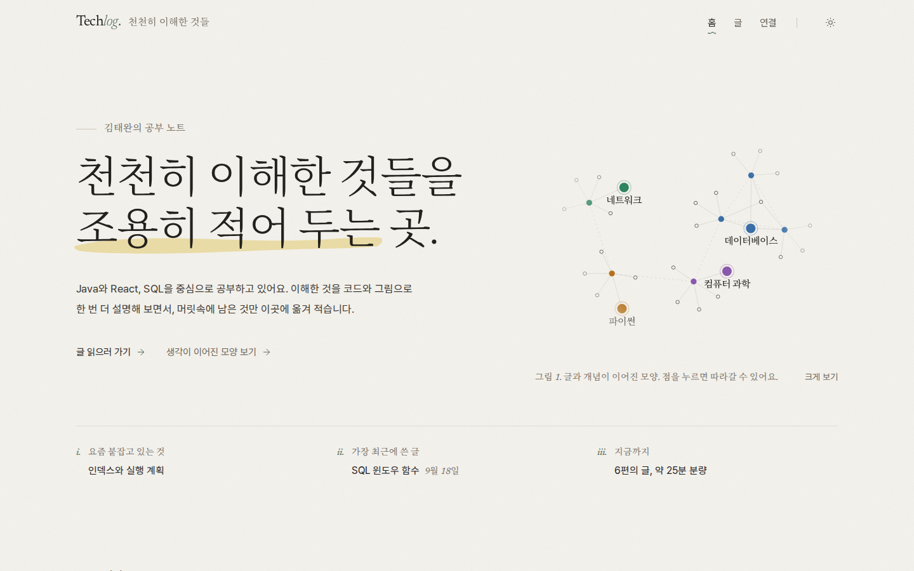
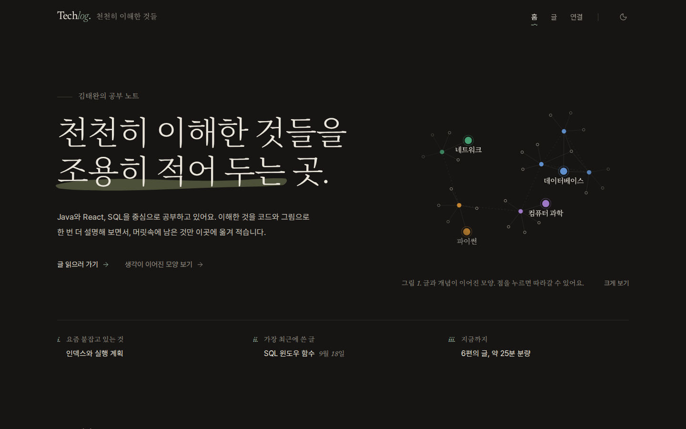
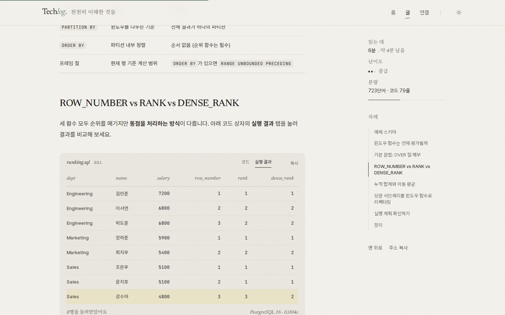
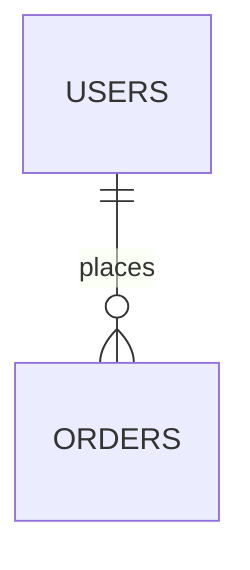

# TechLog

CS · Database/SQL · Python · Computer Networking을 천천히 이해하고 조용히 적어 두는 블로그입니다.

| 홈 (라이트) | 홈 (다크) | 글 상세 |
| --- | --- | --- |
|  |  |  |

## 디자인: 종이와 잉크

- **표면**: 따뜻한 오프화이트 종이(Pantone 2026 Cloud Dancer에 가까운 톤) + 아주 옅은 종이 결(SVG 노이즈). 다크 모드는 따뜻한 먹색 밤.
- **구조**: 카드·박스 대신 여백, 가는 선(hairline), 점선 리더, 여백 메모(marginalia)로 나눕니다. 홈은 잡지처럼 인사말 → 이번 글 → 목차형 글 목록 → 주제/배움의 지도 → 공부의 흔적 순서.
- **글꼴**: 제목은 Noto Serif KR + Newsreader(라틴·이탤릭), 본문은 Pretendard, 코드는 JetBrains Mono. 한글에는 가짜 이탤릭을 합성하지 않습니다.
- **색**: 강조색은 세이지 하나. 카테고리 색 4개는 점·선 같은 작은 표식에만 쓰며, dataviz 팔레트 검증기(색각 이상 대비, 채도 하한, 명도 대역)를 라이트/다크 모두 통과한 값입니다. 텍스트 대비는 WCAG AA(4.5:1)를 만족합니다.
- **움직임**: 짧은 거리·긴 호흡(0.8~1s, ease-out)으로만 움직이고, 운영체제의 "동작 줄이기" 설정을 따릅니다.

## 기술 스택

- **Next.js 15 (App Router) + TypeScript**, React 19
- **Tailwind CSS 3** (`tailwind.config.js`) + `clsx` / `tailwind-merge` + Radix UI (shadcn 패턴)
- **framer-motion** — 떠오르는 등장, 손글씨 밑줄, 형광펜 강조, TOC `layoutId`, 테마 전환
- **MDX** (`next-mdx-remote/rsc`) + **shiki** (`rehype-pretty-code`) + **KaTeX** + **Mermaid**
- **react-force-graph-2d** — 인터랙티브 지식 그래프

## 시작하기

```bash
npm install
npm run dev        # http://localhost:3000
npm run build && npm start
npm run lint       # ESLint
npm run typecheck  # tsc --noEmit
```

Node.js 18.18 이상이 필요합니다(20 LTS 이상 권장). 폰트(Pretendard, Noto Serif KR, Newsreader, Inter, JetBrains Mono)는 npm 패키지로 self-host 하므로 빌드 시 외부 네트워크가 필요 없습니다.

## 디렉터리 구조

```
techlog/
├─ content/posts/*.mdx           # 블로그 글 (frontmatter + MDX)
├─ tailwind.config.js            # 디자인 토큰, 폰트, typography(prose-paper)
├─ src/
│  ├─ app/
│  │  ├─ layout.tsx              # 루트 레이아웃 + ThemeProvider + 폰트
│  │  ├─ template.tsx            # 페이지 전환 (Fade & Slide Up)
│  │  ├─ globals.css             # 종이/먹 토큰, 종이 결, 코드블록·KaTeX·그림 번호 스타일
│  │  ├─ page.tsx                # 홈: 에디토리얼 레이아웃
│  │  ├─ posts/page.tsx          # 글 목록 + 카테고리/태그/검색 필터
│  │  ├─ posts/[slug]/page.tsx   # 글 상세: 2단 레이아웃 + Sticky TOC
│  │  └─ graph/page.tsx          # 지식 그래프 전체 화면
│  ├─ components/
│  │  ├─ layout/                 # 헤더(손글씨 밑줄), 판권면 푸터, 테마 토글(원형 clip-path), 워드마크
│  │  ├─ home/                   # 인사말·별자리, 이번 글, 글 목록, 주제, 배움의 지도, 공부의 흔적
│  │  ├─ post/                   # TOC(scroll-spy), 읽기 진행바, 사이드바, 난이도 태그
│  │  ├─ mdx/                    # CodeBlock, SqlResult, MathCalc, Mermaid, Callout
│  │  ├─ graph/                  # KnowledgeGraph (canvas) + GraphExplorer
│  │  ├─ posts/                  # PostExplorer (필터 UI)
│  │  └─ ui/                     # Popover, Dialog (Radix)
│  ├─ lib/
│  │  ├─ posts.ts                # MDX 파일 로딩, 태그/관련 글 계산
│  │  ├─ mdx.ts                  # remark/rehype 파이프라인
│  │  ├─ remark-mermaid.ts       # ```mermaid → <Mermaid /> 변환
│  │  ├─ toc.ts, reading-time.ts # 목차 추출, 한/영 혼합 읽기 시간
│  │  ├─ graph.ts                # 지식 그래프 노드/링크 생성
│  │  ├─ calculators.ts          # <MathCalc> 수식 계산기 레지스트리
│  │  ├─ study-data.ts           # 홈 학습 통계 목업 데이터
│  │  └─ site.ts                 # 사이트/작성자/카테고리 설정
│  └─ types/post.ts
```

## 글 쓰기

`content/posts/새-글.mdx` 파일을 만들면 목록, 지식 그래프, 관련 글에 자동으로 반영됩니다.

```mdx
---
title: "글 제목"
shortTitle: "그래프 노드용 짧은 제목"   # 선택
quote: "홈 '이번 글'에 쓰일 한 줄"      # 선택
description: "한두 문장 요약"
date: "2026-09-23"
category: database          # cs | database | python | network
tags: ["SQL", "Index"]
difficulty: intermediate    # beginner | intermediate | advanced
featured: true              # 선택: 홈 카드 후보
series: "SQL Deep Dive"     # 선택
related: ["sql-window-functions"]  # 선택: 그래프에서 점선으로 연결
---
```

### 코드 블록

````mdx
```sql title="query.sql" {2-3}
SELECT *
FROM employees          -- 2~3번 줄 하이라이트
WHERE salary > 5000;
```

```python title="diff.py"
old_line()  # [!code --]
new_line()  # [!code ++]
```
````

- 파일 이름, 언어, 줄 번호, "복사" 버튼이 자동으로 붙습니다 (diff에서 삭제 줄은 복사에서 제외). 코드 색은 Kanagawa(lotus/dragon) 테마입니다.
- `// [!code focus]` 로 특정 줄 포커스, `/word/` 로 단어 하이라이트도 지원합니다.

### SQL 실행 결과 탭 (코드 / 실행 결과)

````mdx
<SqlResult
  columns={["dept", "avg_salary"]}
  rows={[["Engineering", 6933], ["Sales", 5000]]}
  highlight={[0]}
  engine="Oracle Database"
  time="0.004s"
>

```sql
SELECT dept, AVG(salary) FROM employees GROUP BY dept;
```

</SqlResult>
````

### 수식 (KaTeX) + 미니 계산기

```mdx
인라인 $O(N \log N)$, 블록은 $$ ... $$

<MathCalc id="nlogn" />          {/* 인라인, 클릭하면 계산기 팝오버 */}
<MathCalc id="mathis" block />   {/* 블록 형태 */}
```

계산기는 `src/lib/calculators.ts`에 등록합니다 (`nlogn`, `sort-lower-bound`, `mathis`, `bdp`, `generator-memory` 기본 제공).

### Mermaid 다이어그램

````mdx

````

라이트/다크 테마에 맞춰 다시 그려지고, 본문 안에서 "그림 1." 처럼 차례로 번호가 붙으며 "크게 보기"로 확대할 수 있습니다. 블록 수식에는 오른쪽에 (1), (2) 식 번호가 붙습니다.

### Callout

```mdx
<Callout type="tip" title="제목">내용</Callout>   {/* info | tip | warn | perf */}
```

## 커스터마이징

- 작성자 정보, 내비게이션, "요즘 붙잡고 있는 것": `src/lib/site.ts`
- 색상 토큰(라이트/다크): `src/app/globals.css`의 `:root`, `.dark` (Tailwind 매핑은 `tailwind.config.js`)
- 배움의 지도 항목, 이번 주 목표: `src/components/home/learning-path.tsx`
- 공부의 흔적: `src/lib/study-data.ts` (현재 목업 데이터 — WakaTime/GitHub API 등으로 교체 가능)
