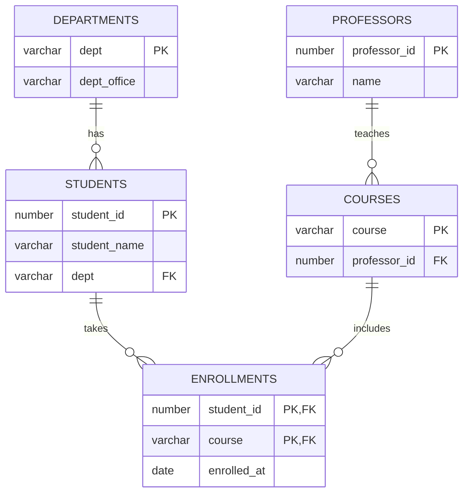

정규화(Normalization)는 **"한 가지 사실은 한 곳에만 저장한다"** 는 원칙을 체계화한 것입니다. 이 원칙이 깨지면 같은 정보를 여러 곳에서 고쳐야 하고, 언젠가는 반드시 어긋납니다.

## 출발점: 모든 걸 담은 테이블

대학 수강 신청 데이터를 엑셀처럼 한 테이블에 모두 담았다고 해 봅시다.

<SqlResult
  columns={["student_id", "student_name", "dept", "dept_office", "courses", "professor"]}
  rows={[
    [2021001, "김하늘", "컴퓨터공학", "공학관 301", "DB, 네트워크", "이교수, 박교수"],
    [2021002, "이바다", "컴퓨터공학", "공학관 301", "DB", "이교수"],
    [2021003, "최산", "경영학", "경영관 105", "회계원리", "정교수"]
  ]}
  engine="Oracle Database"
  time="0.003s"
>

```sql title="enrollment_raw.sql"
SELECT student_id, student_name, dept, dept_office, courses, professor
FROM enrollment_raw;
```

</SqlResult>

이 테이블에는 세 가지 **이상 현상(Anomaly)** 이 숨어 있습니다.

| 이상 현상 | 예시 |
| --- | --- |
| 삽입 이상 | 아직 수강생이 없는 새 과목을 등록할 수 없다 |
| 갱신 이상 | 컴퓨터공학과 사무실이 이전하면 여러 행을 모두 고쳐야 한다 |
| 삭제 이상 | 최산 학생이 자퇴하면 "회계원리는 정교수 담당" 정보도 사라진다 |

## 함수 종속성 (Functional Dependency)

정규화의 모든 단계는 함수 종속성으로 설명됩니다. $X \rightarrow Y$ 는 **"X 값을 알면 Y 값이 하나로 정해진다"** 는 뜻입니다.

$$
\text{student\_id} \rightarrow \text{student\_name},\; \text{dept} \qquad \text{dept} \rightarrow \text{dept\_office}
$$

## 1NF: 원자값

**조건**: 모든 컬럼 값이 더 이상 쪼갤 수 없는 원자값(atomic value)이어야 합니다. `"DB, 네트워크"` 처럼 한 칸에 여러 값을 넣으면 안 됩니다.

```sql title="1nf.sql"
-- 수강 과목을 행 단위로 분리
CREATE TABLE enrollment_1nf (
  student_id   NUMBER,
  student_name VARCHAR2(50),
  dept         VARCHAR2(50),
  dept_office  VARCHAR2(50),
  course       VARCHAR2(50),
  professor    VARCHAR2(50),
  CONSTRAINT pk_enroll_1nf PRIMARY KEY (student_id, course)
);
```

## 2NF: 부분 함수 종속 제거

**조건**: 1NF이면서, 기본키가 복합키일 때 **키의 일부에만 종속된 컬럼이 없어야** 합니다.

기본키가 `(student_id, course)` 인데 `student_name`은 `student_id`만으로 결정됩니다(부분 종속). `professor`는 `course`만으로 결정됩니다. 이들을 별도 테이블로 분리합니다.

## 3NF: 이행 함수 종속 제거

**조건**: 2NF이면서, 키가 아닌 컬럼이 **다른 키가 아닌 컬럼을 거쳐** 결정되면 안 됩니다.

$$
\text{student\_id} \rightarrow \text{dept} \rightarrow \text{dept\_office}
$$

`dept_office`는 학생이 아니라 학과의 속성이므로 `departments` 테이블로 옮깁니다. 이렇게 3NF까지 분리한 결과가 아래 ERD입니다.



이제 학과 사무실이 이전해도 `departments`의 **한 행만** 수정하면 됩니다.

## BCNF: 모든 결정자는 슈퍼키

**조건**: 모든 함수 종속 $X \rightarrow Y$ 에서 $X$ 가 **슈퍼키(super key)** 여야 합니다. 즉, 무언가를 결정하는 컬럼 집합은 반드시 행 전체를 식별할 수 있어야 합니다. 3NF보다 조금 더 엄격합니다.

예를 들어 `(학생, 과목) → 교수` 이고 "교수는 한 과목만 가르친다" 즉 `교수 → 과목` 이라면, 결정자인 `교수`가 슈퍼키가 아니므로 BCNF 위반입니다. `(학생, 교수)` 와 `(교수, 과목)` 으로 분해합니다.

<Callout type="info" title="3NF vs BCNF">
대부분의 실무 스키마는 3NF에서 이미 BCNF를 만족합니다. 차이는 **후보키가 여러 개이고 서로 겹칠 때** 주로 나타납니다. BCNF 분해는 일부 함수 종속을 보존하지 못할 수 있다는 점도 알아 두세요.
</Callout>

## 다시 합쳐 보기: JOIN으로 원래 뷰 복원

정규화는 정보를 잃는 게 아니라 **분해** 하는 것입니다. 무손실 분해이므로 JOIN으로 원래 모습을 언제든 복원할 수 있습니다.

<SqlResult
  columns={["student_name", "dept", "dept_office", "course", "professor"]}
  rows={[
    ["김하늘", "컴퓨터공학", "공학관 301", "DB", "이교수"],
    ["김하늘", "컴퓨터공학", "공학관 301", "네트워크", "박교수"],
    ["이바다", "컴퓨터공학", "공학관 301", "DB", "이교수"],
    ["최산", "경영학", "경영관 105", "회계원리", "정교수"]
  ]}
  engine="Oracle Database"
  time="0.006s"
>

```sql title="rebuild_view.sql" {4-7}
SELECT s.student_name, d.dept, d.dept_office,
       c.course, p.name AS professor
FROM students s
JOIN departments d ON d.dept = s.dept
JOIN enrollments e ON e.student_id = s.student_id
JOIN courses c     ON c.course = e.course
JOIN professors p  ON p.professor_id = c.professor_id
ORDER BY s.student_id, c.course;
```

</SqlResult>

## 반정규화는 언제?

JOIN이 너무 많아 조회 성능이 문제될 때는 **의도적으로** 중복을 허용하기도 합니다(반정규화). 단, 반드시 측정 후에 결정하고 동기화 전략(트리거, 배치, 애플리케이션 로직)을 함께 설계해야 합니다. 조회 성능 문제는 먼저 인덱스와 [윈도우 함수](/posts/sql-window-functions) 같은 쿼리 개선으로 풀 수 있는지 확인하세요.

## 정리

- **1NF**: 원자값 — 한 칸에 하나의 값
- **2NF**: 부분 함수 종속 제거 — 복합키의 일부에만 의존하는 컬럼 분리
- **3NF**: 이행 함수 종속 제거 — 키가 아닌 컬럼을 거치는 종속 분리
- **BCNF**: 모든 결정자가 슈퍼키
- 정규화는 무손실 분해이며, 반정규화는 측정에 근거한 예외여야 한다.
