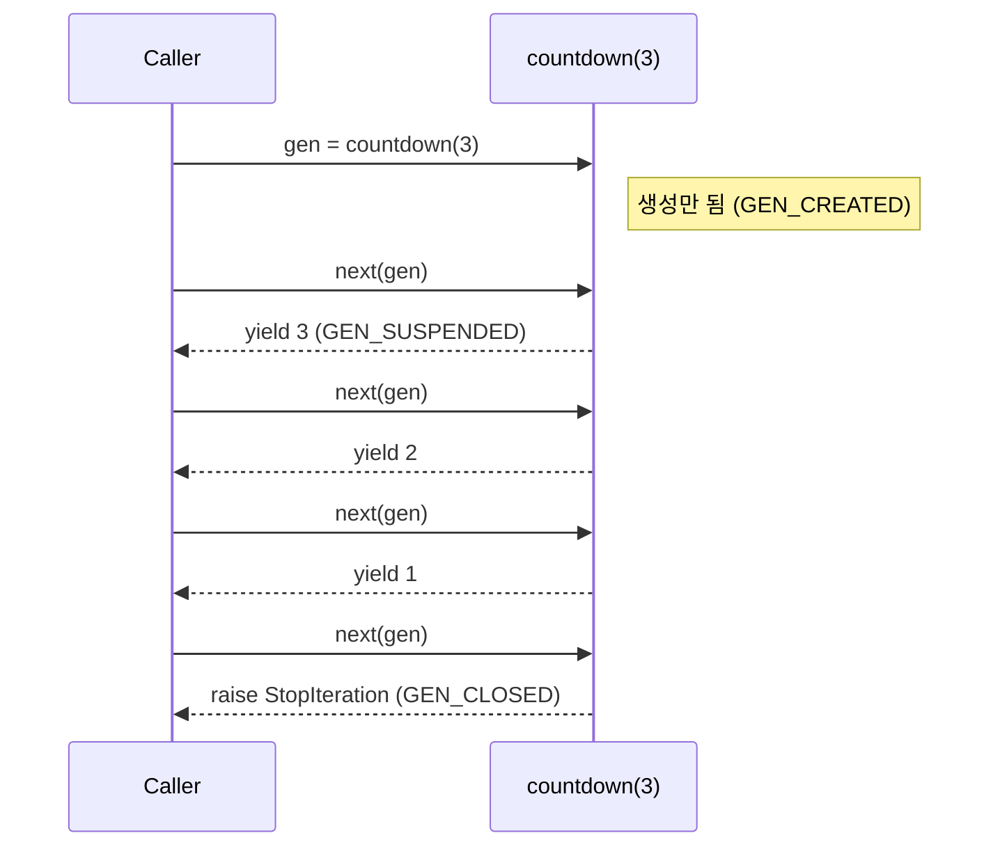
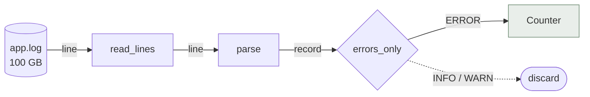

대용량 CSV나 로그를 처리하다 `MemoryError`를 만난 적이 있다면, 원인은 대부분 **"한 번에 다 읽어서 리스트에 담았기 때문"** 입니다. 제너레이터는 값을 **필요할 때 하나씩** 만들어 내는 방식으로 이 문제를 해결합니다.

## 리스트 vs 제너레이터

같은 100만 개의 제곱수를 두 방식으로 만들어 보겠습니다.

```python title="memory_compare.py"
import sys

squares_list = [n * n for n in range(1_000_000)]
squares_gen  = (n * n for n in range(1_000_000))

print(sys.getsizeof(squares_list))  # 8448728  (≈ 8.06 MB, 포인터 배열만)
print(sys.getsizeof(squares_gen))   # 208      (CPython 3.11 기준, N과 무관하게 일정)
```

`sys.getsizeof`는 컨테이너 자신의 크기만 재기 때문에, 리스트는 실제로 **원소 객체(int 하나당 28~32바이트)** 까지 합치면 30MB가 넘습니다. 반면 제너레이터 객체는 "다음 값을 만드는 방법"과 현재 실행 위치만 기억합니다.

N과 원소 크기를 바꿔 가며 차이를 직접 확인해 보세요: <MathCalc id="generator-memory" />

## yield는 어떻게 동작할까

제너레이터 함수는 호출해도 **본문이 실행되지 않습니다.** 대신 제너레이터 객체를 돌려주고, `next()`가 호출될 때마다 다음 `yield`까지만 실행한 뒤 **프레임을 그대로 얼려 둡니다(suspend).**



```python title="countdown.py"
import inspect

def countdown(n: int):
    print("start!")          # 첫 next() 때 비로소 실행
    while n > 0:
        yield n
        n -= 1

gen = countdown(3)
print(inspect.getgeneratorstate(gen))  # GEN_CREATED
print(next(gen))                       # start!  →  3
print(inspect.getgeneratorstate(gen))  # GEN_SUSPENDED
print(list(gen))                       # [2, 1]
```

## 리팩터링: 로그 분석 파이프라인

실무에서 흔한 "에러 로그만 골라 IP별로 세기" 코드를 제너레이터로 바꿔 봅시다. 초록색 줄이 새 코드, 빨간 줄이 제거된 코드입니다.

```python title="log_pipeline.py"
from collections import Counter
from pathlib import Path

def read_lines(path: Path):
    with path.open(encoding="utf-8") as f:
        return f.readlines()  # [!code --]
        yield from f          # [!code ++]

def parse(lines):
    return [line.split(" ", 3) for line in lines]  # [!code --]
    for line in lines:                              # [!code ++]
        yield line.split(" ", 3)                    # [!code ++]

def errors_only(records):
    return [r for r in records if r[2] == "ERROR"]  # [!code --]
    return (r for r in records if r[2] == "ERROR")  # [!code ++]

counts = Counter(ip for _, ip, *_ in errors_only(parse(read_lines(Path("app.log")))))
print(counts.most_common(5))
```

변경 전 코드는 단계마다 **전체 데이터를 리스트로 복제**합니다. 변경 후에는 파일에서 한 줄을 읽으면 그 한 줄이 파이프라인 끝까지 흘러간 뒤 버려지므로, 파일이 1GB든 100GB든 메모리 사용량이 거의 일정합니다.



<Callout type="warn" title="제너레이터는 한 번만 소비된다">
제너레이터는 이터레이터이므로 **끝까지 순회하면 다시 쓸 수 없습니다.** 같은 데이터를 두 번 순회해야 한다면 리스트로 만들거나, 제너레이터 함수를 다시 호출하세요. `itertools.tee`도 있지만 내부적으로 버퍼링하므로 메모리 이점이 줄어듭니다.
</Callout>

## 공간 복잡도 관점

파이프라인 단계가 $k$ 개, 데이터가 $N$ 개일 때 리스트 방식은 중간 결과를 모두 보관하므로 최악의 경우 $O(kN)$, 제너레이터 방식은 단계마다 원소 하나만 들고 있으므로 $O(k)$ 입니다.

$$
M_{\text{list}} = \sum_{i=1}^{k} |S_i| = O(kN) \qquad\text{vs}\qquad M_{\text{gen}} = O(k)
$$

시간 복잡도는 둘 다 $O(N)$ 으로 같습니다. 오히려 제너레이터는 원소마다 프레임 재개 비용이 있어 **순수 CPU 연산만 보면 리스트 컴프리헨션이 약간 더 빠를 수** 있습니다. 데이터가 메모리에 충분히 들어간다면 리스트도 좋은 선택입니다.

## yield from과 send()

`yield from`은 하위 제너레이터에 반복을 위임하고, `send()`는 제너레이터 안으로 값을 **밀어 넣습니다.** 이 두 기능이 `async/await` 코루틴의 뿌리입니다.

```python title="running_average.py"
def running_average():
    total, count, avg = 0.0, 0, None
    while True:
        value = yield avg   # send()로 들어온 값을 받는다
        total += value
        count += 1
        avg = total / count

avg = running_average()
next(avg)            # 첫 yield까지 전진 (priming)
print(avg.send(10))  # 10.0
print(avg.send(20))  # 15.0
print(avg.send(60))  # 30.0
```

## 정리

- 리스트는 **모든 값을 미리** 만들고, 제너레이터는 **요청할 때 하나씩** 만든다.
- 제너레이터 함수는 호출 시 실행되지 않고, `next()`마다 다음 `yield`까지 실행 후 일시 정지한다.
- 파이프라인을 제너레이터로 연결하면 메모리는 $O(1)$ 에 가깝게 유지된다.
- 한 번만 순회 가능하다는 제약과, 작은 데이터에서의 약간의 오버헤드는 트레이드오프다.
