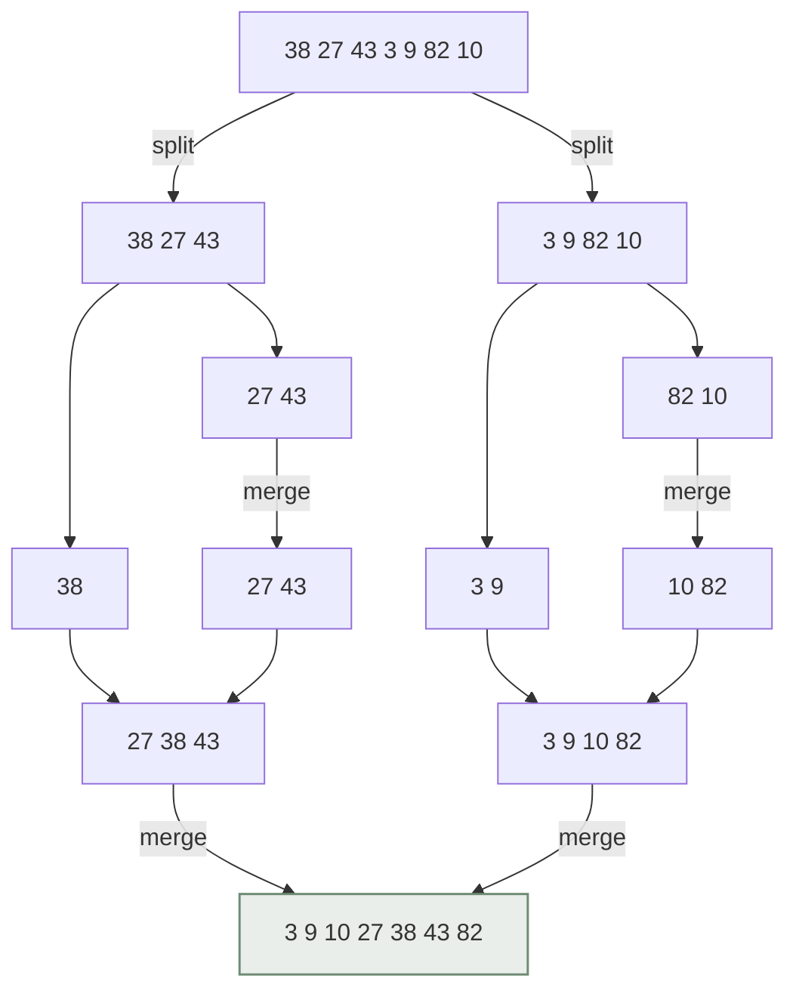

정렬은 컴퓨터 과학에서 가장 많이 연구된 문제 중 하나입니다. 데이터베이스의 `ORDER BY`, 인덱스 생성, 중복 제거까지 — 정렬 성능은 시스템 전체 성능과 직결됩니다. 이 글에서는 대표적인 정렬 알고리즘을 비교하고, **"비교 기반 정렬은 왜 <MathCalc id="nlogn" /> 보다 빠를 수 없는가"** 를 증명해 봅니다.

## 한눈에 보는 정렬 알고리즘

| 알고리즘 | 평균 | 최악 | 추가 공간 | 안정 정렬 |
| --- | --- | --- | --- | :---: |
| 버블 정렬 | $O(N^2)$ | $O(N^2)$ | $O(1)$ | ✅ |
| 삽입 정렬 | $O(N^2)$ | $O(N^2)$ | $O(1)$ | ✅ |
| 병합 정렬 | $O(N \log N)$ | $O(N \log N)$ | $O(N)$ | ✅ |
| 퀵 정렬 | $O(N \log N)$ | $O(N^2)$ | $O(\log N)$ | ❌ |
| 힙 정렬 | $O(N \log N)$ | $O(N \log N)$ | $O(1)$ | ❌ |
| Timsort (Python) | $O(N \log N)$ | $O(N \log N)$ | $O(N)$ | ✅ |

## 병합 정렬: 분할 정복의 교과서

배열을 반으로 나누고(분할), 각각 정렬한 뒤(정복), 두 정렬된 배열을 합칩니다(병합).



```python title="merge_sort.py" {12-16}
def merge_sort(arr: list[int]) -> list[int]:
    if len(arr) <= 1:
        return arr

    mid = len(arr) // 2
    left = merge_sort(arr[:mid])
    right = merge_sort(arr[mid:])
    return merge(left, right)

def merge(left: list[int], right: list[int]) -> list[int]:
    result, i, j = [], 0, 0
    while i < len(left) and j < len(right):
        if left[i] <= right[j]:   # <= 이라서 안정 정렬
            result.append(left[i]); i += 1
        else:
            result.append(right[j]); j += 1
    result.extend(left[i:])
    result.extend(right[j:])
    return result

print(merge_sort([38, 27, 43, 3, 9, 82, 10]))
# [3, 9, 10, 27, 38, 43, 82]
```

## 마스터 정리로 점화식 풀기

병합 정렬의 실행 시간은 크기가 절반인 문제 두 개와 선형 병합으로 이루어집니다.

$$
T(N) = 2\,T\!\left(\frac{N}{2}\right) + O(N)
$$

마스터 정리 $T(N) = a\,T(N/b) + f(N)$ 에서 $a = 2,\; b = 2$ 이므로 $N^{\log_b a} = N$ 이고, $f(N) = \Theta(N)$ 과 같은 차수입니다(Case 2). 따라서

$$
T(N) = \Theta(N \log N)
$$

직관적으로는 트리의 **높이가 $\log_2 N$**, 각 레벨에서 하는 일이 **총 $N$** 이므로 곱해서 $N \log N$ 입니다.

## 퀵 정렬: 평균은 빠르지만 최악은 N²

퀵 정렬은 피벗을 기준으로 작은 값/큰 값을 나눈 뒤 재귀합니다. 피벗이 항상 최솟값이나 최댓값으로 뽑히면(이미 정렬된 배열 + 첫 원소 피벗) 분할이 $N-1$ 과 $0$ 으로 쪼개져 $O(N^2)$ 이 됩니다.

```python title="quick_sort.py"
import random

def quick_sort(arr: list[int]) -> list[int]:
    if len(arr) <= 1:
        return arr
    pivot = arr[0]                 # [!code --]
    pivot = random.choice(arr)     # [!code ++]
    less    = [x for x in arr if x < pivot]
    equal   = [x for x in arr if x == pivot]
    greater = [x for x in arr if x > pivot]
    return quick_sort(less) + equal + quick_sort(greater)
```

<Callout type="tip" title="랜덤 피벗 한 줄의 힘">
피벗을 무작위로 고르면 어떤 입력이 들어와도 **기대** 시간 복잡도가 $O(N \log N)$ 이 됩니다. 실무 구현(Introsort)은 여기에 더해 재귀 깊이가 $2\log N$ 을 넘으면 힙 정렬로 전환해 최악의 경우까지 보장합니다.
</Callout>

## 하한 증명: 결정 트리

비교 기반 정렬은 "$a_i \le a_j$ 인가?"라는 질문을 반복하는 **이진 결정 트리** 로 모델링할 수 있습니다.

- 리프 노드는 가능한 정렬 결과(순열)이므로 최소 $N!$ 개가 필요합니다.
- 높이가 $h$ 인 이진 트리의 리프는 최대 $2^h$ 개입니다.

$$
2^h \ge N! \quad\Longrightarrow\quad h \ge \log_2 (N!)
$$

스털링 근사 $\ln N! \approx N \ln N - N$ 을 쓰면 <MathCalc id="sort-lower-bound" /> 이고, 이는 $\Omega(N \log N)$ 입니다. 즉, **최악의 경우 필요한 비교 횟수(트리 높이)** 는 $N \log N$ 에 비례할 수밖에 없습니다. 수식을 클릭해 N을 바꿔 보면, 병합 정렬의 비교 횟수 상한이 이론적 하한과 매우 가깝다는 걸 확인할 수 있습니다.

<Callout type="info" title="그럼 계수 정렬(Counting Sort)은?">
계수 정렬·기수 정렬은 원소끼리 **비교하지 않고** 값 자체를 인덱스로 사용하기 때문에 이 하한의 적용을 받지 않습니다. 대신 값의 범위 $k$ 에 따라 $O(N + k)$ 의 시간과 공간이 필요합니다.
</Callout>

## 정리

- 병합 정렬은 항상 $O(N \log N)$ 이지만 $O(N)$ 추가 공간이 필요하다.
- 퀵 정렬은 평균적으로 가장 빠르지만, 피벗 선택이 나쁘면 $O(N^2)$ — 랜덤 피벗이나 Introsort로 방어한다.
- 비교 기반 정렬의 하한은 결정 트리로 증명되는 $\Omega(N \log N)$ 이다.
- 값의 범위가 작다면 비교하지 않는 정렬로 이 한계를 우회할 수 있다.
