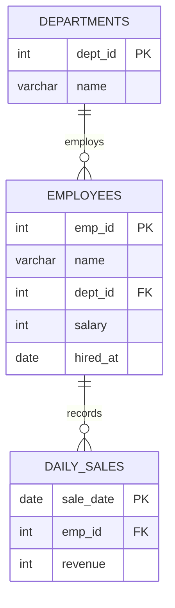
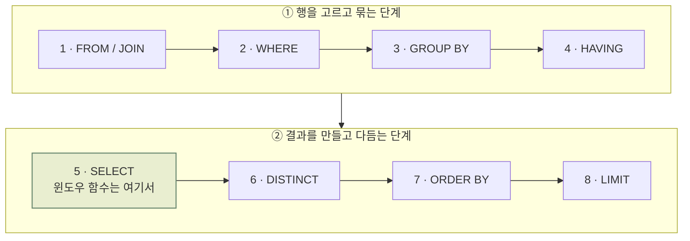

`GROUP BY`는 강력하지만 **행을 접어버린다**는 한계가 있습니다. 부서별 평균 급여를 구하는 순간, 각 직원의 이름은 결과에서 사라지죠. 윈도우 함수(Window Function)는 이 문제를 정면으로 해결합니다. **원래 행은 그대로 두고, 옆에 집계 결과를 붙이는 것**이 핵심입니다.

이 글에서는 예제 스키마를 기준으로 순위 함수, 누적 집계, 프레임 절을 차례로 살펴보고, 상관 서브쿼리를 윈도우 함수로 리팩터링했을 때 실행 비용이 어떻게 달라지는지 확인합니다.

## 예제 스키마

모든 예제는 아래 두 테이블을 사용합니다. `employees`는 부서에 소속되고, `daily_sales`는 일자별 매출을 저장합니다.



## 윈도우 함수는 언제 평가될까

윈도우 함수를 이해하려면 **논리적 쿼리 처리 순서**부터 알아야 합니다. SQL은 작성 순서(`SELECT → FROM → WHERE`)와 실행 순서가 다릅니다.



윈도우 함수는 `SELECT` 단계에서 평가됩니다. 그래서 **`WHERE` 절에서 윈도우 함수 결과를 바로 필터링할 수 없고**, 서브쿼리나 CTE로 한 번 감싸야 합니다. 뒤에서 이 패턴을 다시 사용합니다.

## 기본 문법: OVER 절 해부

```sql title="window_syntax.sql"
<function>(<expr>) OVER (
    PARTITION BY <column>          -- 어떤 그룹 안에서 계산할지
    ORDER BY <column> [ASC|DESC]   -- 그룹 안의 정렬 순서
    ROWS BETWEEN <start> AND <end> -- 프레임: 계산에 포함할 행 범위
)
```

| 구성 요소 | 역할 | 생략 시 |
| --- | --- | --- |
| `PARTITION BY` | 윈도우를 나누는 기준 | 전체 결과가 하나의 파티션 |
| `ORDER BY` | 파티션 내부 정렬 | 순서 없음 (순위 함수는 필수) |
| 프레임 절 | 현재 행 기준 계산 범위 | `ORDER BY`가 있으면 `RANGE UNBOUNDED PRECEDING` |

## ROW_NUMBER vs RANK vs DENSE_RANK

세 함수 모두 순위를 매기지만 **동점을 처리하는 방식**이 다릅니다. 아래 코드 상자의 **실행 결과** 탭을 눌러 결과를 비교해 보세요.

<SqlResult
  columns={["dept", "name", "salary", "row_number", "rank", "dense_rank"]}
  rows={[
    ["Engineering", "김민준", 7200, 1, 1, 1],
    ["Engineering", "이서연", 6800, 2, 2, 2],
    ["Engineering", "박도윤", 6800, 3, 2, 2],
    ["Marketing", "정하준", 5900, 1, 1, 1],
    ["Marketing", "최지우", 5400, 2, 2, 2],
    ["Sales", "조은우", 5100, 1, 1, 1],
    ["Sales", "윤지호", 5100, 2, 1, 1],
    ["Sales", "강수아", 4800, 3, 3, 2]
  ]}
  highlight={[7]}
  time="0.004s"
>

```sql title="ranking.sql" {3-5}
SELECT dept, name, salary,
       -- 같은 부서 안에서 급여 내림차순으로 순위 매기기
       ROW_NUMBER() OVER w AS row_number,
       RANK()       OVER w AS rank,
       DENSE_RANK() OVER w AS dense_rank
FROM employees
WINDOW w AS (PARTITION BY dept ORDER BY salary DESC)
ORDER BY dept, row_number;
```

</SqlResult>

Sales 부서의 마지막 행(강수아)을 보면 차이가 명확합니다.

- `ROW_NUMBER`: 동점이어도 무조건 1, 2, 3 — **고유 번호**
- `RANK`: 동점은 같은 순위, 다음 순위는 건너뜀 — 1, 1, **3**
- `DENSE_RANK`: 동점은 같은 순위, 건너뛰지 않음 — 1, 1, **2**

<Callout type="tip" title="WINDOW 절">
같은 윈도우 정의를 여러 번 쓴다면 `WINDOW w AS (...)`로 이름을 붙여 재사용하세요. PostgreSQL, MySQL 8.0+, SQLite가 지원하고 Oracle은 21c부터 지원합니다. 그 이전 Oracle 버전이라면 `OVER (...)`를 반복해서 써야 합니다.
</Callout>

## 누적 합계와 이동 평균

프레임 절을 사용하면 **"현재 행 기준 앞뒤 몇 개의 행"**만 집계할 수 있습니다. 대시보드에서 자주 쓰는 누적 매출과 3일 이동 평균을 한 번에 구해 봅시다.

<SqlResult
  columns={["sale_date", "revenue", "running_total", "moving_avg_3d"]}
  rows={[
    ["2026-09-01", 120, 120, "120.00"],
    ["2026-09-02", 80, 200, "100.00"],
    ["2026-09-03", 150, 350, "116.67"],
    ["2026-09-04", 90, 440, "106.67"],
    ["2026-09-05", 200, 640, "146.67"]
  ]}
  time="0.002s"
>

```sql title="running_total.sql"
SELECT sale_date,
       revenue,
       SUM(revenue) OVER (
         ORDER BY sale_date
         ROWS BETWEEN UNBOUNDED PRECEDING AND CURRENT ROW
       ) AS running_total,
       ROUND(AVG(revenue) OVER (
         ORDER BY sale_date
         ROWS BETWEEN 2 PRECEDING AND CURRENT ROW
       ), 2) AS moving_avg_3d
FROM daily_sales
ORDER BY sale_date;
```

</SqlResult>

3일 이동 평균의 네 번째 값은 다음과 같이 계산됩니다.

$$
\text{MA}_3(t_4) = \frac{r_{2} + r_{3} + r_{4}}{3} = \frac{80 + 150 + 90}{3} \approx 106.67
$$

<Callout type="warn" title="ROWS vs RANGE">
`ORDER BY`만 쓰고 프레임을 생략하면 기본값은 `RANGE BETWEEN UNBOUNDED PRECEDING AND CURRENT ROW`입니다. `RANGE`는 **정렬 키가 같은 행을 한 묶음**으로 취급하므로, 같은 날짜가 여러 행이면 누적 합계가 예상과 다르게 한 번에 점프합니다. 의도가 "행 단위"라면 `ROWS`를 명시하세요.
</Callout>

## 상관 서브쿼리를 윈도우 함수로 리팩터링

"부서별 최고 연봉자"를 구하는 전형적인 코드입니다. 상관 서브쿼리 버전은 바깥 행마다 서브쿼리를 다시 평가할 수 있어서, 인덱스가 없다면 최악의 경우 $O(N^2)$ 에 가까워집니다.

```sql title="top_earner.sql"
SELECT dept, name, salary
FROM employees e -- [!code --]
WHERE salary = ( -- [!code --]
  SELECT MAX(salary) -- [!code --]
  FROM employees x -- [!code --]
  WHERE x.dept = e.dept -- [!code --]
); -- [!code --]
FROM ( -- [!code ++]
  SELECT *, -- [!code ++]
         RANK() OVER (PARTITION BY dept ORDER BY salary DESC) AS rnk -- [!code ++]
  FROM employees -- [!code ++]
) ranked -- [!code ++]
WHERE rnk = 1; -- [!code ++]
```

윈도우 함수 버전은 테이블을 한 번 스캔하고 `(dept, salary)` 기준으로 한 번 정렬합니다. 정렬 비용이 지배적이므로 전체 복잡도는 <MathCalc id="nlogn" /> 입니다. 수식을 클릭해서 N을 바꿔 보면, 행이 100만 개일 때 두 방식의 이론적 연산량 차이가 수만 배까지 벌어지는 걸 확인할 수 있습니다.

파티션 크기가 $n_1, n_2, \dots, n_k$ 라면 파티션별 정렬 비용의 합은 전체 정렬 비용을 넘지 않습니다.

$$
\sum_{i=1}^{k} n_i \log n_i \;\le\; \sum_{i=1}^{k} n_i \log N \;=\; N \log N
$$

<Callout type="perf">
`(dept, salary DESC)` 복합 인덱스가 있으면 옵티마이저가 정렬 단계를 생략하고 인덱스 순서대로 읽을 수 있습니다. PostgreSQL에서는 `EXPLAIN ANALYZE`로 `Sort` 노드가 `Index Scan`으로 바뀌는지 확인해 보세요.
</Callout>

## 실행 계획 확인하기

```sql title="explain.sql"
EXPLAIN (ANALYZE, BUFFERS)
SELECT dept, name, salary,
       RANK() OVER (PARTITION BY dept ORDER BY salary DESC) AS rnk
FROM employees;
```

```text title="EXPLAIN output" {1,3}
WindowAgg  (cost=1.19..1.37 rows=8 width=56) (actual time=0.031..0.038 rows=8 loops=1)
  ->  Sort  (cost=1.19..1.21 rows=8 width=48) (actual time=0.024..0.025 rows=8 loops=1)
        Sort Key: dept, salary DESC
        Sort Method: quicksort  Memory: 25kB
        ->  Seq Scan on employees  (cost=0.00..1.08 rows=8 width=48)
Planning Time: 0.092 ms
Execution Time: 0.061 ms
```

`WindowAgg` 바로 아래에 `Sort` 노드가 있고, 정렬 키가 `PARTITION BY` + `ORDER BY` 조합이라는 점을 기억해 두면 튜닝 포인트가 명확해집니다.

## 정리

- 윈도우 함수는 **행을 유지한 채** 집계 결과를 붙인다.
- `SELECT` 단계에서 평가되므로 필터링하려면 서브쿼리/CTE로 감싼다.
- 동점 처리: `ROW_NUMBER`(고유) · `RANK`(건너뜀) · `DENSE_RANK`(연속).
- 누적/이동 집계는 프레임 절을 **`ROWS`로 명시**하는 습관을 들이자.
- 비용의 핵심은 파티션 + 정렬 키 정렬이며, 알맞은 복합 인덱스로 제거할 수 있다.

다음 글에서는 이 테이블 구조가 어떻게 설계되었는지 [데이터베이스 정규화](/posts/database-normalization) 관점에서 살펴봅니다.
