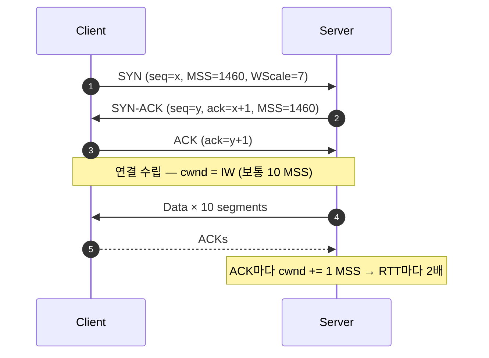
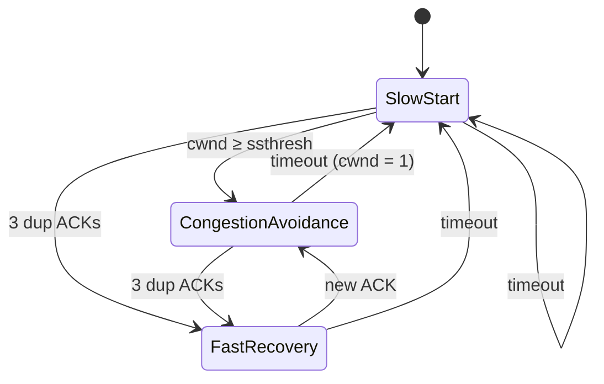

같은 1Gbps 회선인데 서울–도쿄 다운로드는 빠르고 서울–뉴욕은 느린 이유가 뭘까요? 대역폭이 아니라 **지연(RTT)과 손실률**이 처리량을 결정하는 경우가 많기 때문입니다. 그 중심에 TCP의 혼잡 제어(Congestion Control)가 있습니다.

## 3-way Handshake 다시 보기

혼잡 제어는 연결이 수립된 직후부터 시작됩니다. 핸드셰이크에서 교환하는 **MSS**(Maximum Segment Size)와 **수신 윈도우(rwnd)** 가 이후 전송 속도의 상한을 정합니다.



## 혼잡 윈도우(cwnd)란

송신자가 **ACK 없이 한 번에 보낼 수 있는 데이터 양**은 두 값 중 작은 쪽입니다.

$$
\text{in-flight} \le \min(\text{cwnd},\; \text{rwnd})
$$

`rwnd`는 수신자가 알려주는 값(흐름 제어), `cwnd`는 송신자가 네트워크 상태를 추정해 스스로 조절하는 값(혼잡 제어)입니다. RTT마다 윈도우만큼 보낼 수 있으니, 처리량은 대략 $\text{cwnd} / \text{RTT}$ 입니다.

## Slow Start와 Congestion Avoidance

TCP Reno 계열의 상태 전이를 그림으로 보면 다음과 같습니다.



| 단계 | cwnd 변화 | 성격 |
| --- | --- | --- |
| Slow Start | ACK마다 +1 MSS (RTT마다 ×2) | 지수 증가 — 이름과 달리 빠르다 |
| Congestion Avoidance | RTT마다 +1 MSS | 선형 증가 (Additive Increase) |
| 3 dup ACK | `ssthresh = cwnd/2`, cwnd 절반 | Multiplicative Decrease |
| Timeout | `cwnd = 1 MSS` | 가장 강한 페널티 |

이 "선형 증가, 곱셈 감소"를 **AIMD**라고 부르며, 여러 흐름이 병목 링크를 공정하게 나눠 쓰도록 수렴하게 만드는 핵심 원리입니다.

## Python으로 AIMD 시뮬레이션

말로만 보면 감이 안 오니 직접 톱니(sawtooth) 모양을 만들어 봅시다.

```python title="aimd_sim.py" {10-17}
from dataclasses import dataclass

@dataclass
class TcpReno:
    cwnd: float = 1.0      # 단위: MSS
    ssthresh: float = 64.0

    def on_rtt(self, loss: bool) -> float:
        """RTT 1회 동안의 cwnd 변화를 반환"""
        if loss:
            # Multiplicative Decrease (3 dup ACK 가정)
            self.ssthresh = max(self.cwnd / 2, 2)
            self.cwnd = self.ssthresh
        elif self.cwnd < self.ssthresh:
            self.cwnd *= 2          # Slow Start
        else:
            self.cwnd += 1          # Additive Increase
        return self.cwnd

tcp = TcpReno()
loss_at = {9, 21, 33}
trace = [tcp.on_rtt(loss=t in loss_at) for t in range(40)]
print(" ".join(f"{w:g}" for w in trace))
```

```text title="stdout"
2 4 8 16 32 64 65 66 67 33.5 34.5 35.5 36.5 ...
```

손실이 날 때마다 윈도우가 절반으로 떨어지고, 다시 1씩 올라가는 톱니 모양이 나타납니다.

## 손실률과 처리량: Mathis 공식

톱니의 평균 높이를 계산하면, 손실률 $p$ 인 링크에서 Reno의 정상 상태 처리량은 다음과 같이 근사됩니다. 수식을 클릭해서 RTT와 손실률을 바꿔 보세요.

<MathCalc id="mathis" block />

처리량이 $1/\sqrt{p}$ 에 비례한다는 점이 핵심입니다. 손실률이 0.01%에서 1%로 100배 늘면 처리량은 **10배** 줄어듭니다. 그리고 RTT에 반비례하기 때문에, 같은 손실률이라도 대륙 간 연결은 훨씬 느립니다.

<Callout type="info" title="왜 C ≈ 1.22 인가">
윈도우가 $W/2$ 에서 $W$ 까지 선형으로 증가하는 톱니를 가정하면, 한 주기 동안 보내는 패킷 수는 $\tfrac{3}{8}W^2$ 이고 이것이 $1/p$ 와 같아야 합니다. 이를 풀면 평균 윈도우가 $\sqrt{3/(2p)} \approx 1.22/\sqrt{p}$ 가 됩니다.
</Callout>

## 파이프를 가득 채우려면: BDP

손실이 전혀 없어도 윈도우가 작으면 링크를 다 쓰지 못합니다. 링크에 동시에 "떠 있어야" 하는 데이터 양이 대역폭-지연 곱, <MathCalc id="bdp" /> 입니다.

1Gbps · 40ms 링크라면 BDP는 약 5MB입니다. 과거 TCP 헤더의 윈도우 필드는 16비트(최대 64KB)라서, **Window Scale 옵션** 없이는 이 링크의 약 1.3%밖에 쓰지 못합니다. 핸드셰이크에서 `WScale`을 교환하는 이유가 바로 이것입니다.

## CUBIC과 BBR

현대 운영체제는 Reno 대신 더 공격적인 알고리즘을 기본으로 씁니다.

- **CUBIC** (Linux 기본): 마지막 손실 시점 이후 경과 시간 $t$ 에 대한 3차 함수로 윈도우를 키웁니다 (RFC 8312, $\beta = 0.7$, $C = 0.4$). RTT와 무관하게 증가하므로 고 BDP 링크에서 Reno보다 공정하고 빠릅니다.

$$
W_{\text{cubic}}(t) = C\,(t - K)^3 + W_{\max}, \qquad K = \sqrt[3]{\frac{W_{\max}\,(1-\beta)}{C}}
$$

- **BBR** (Google): 손실을 혼잡 신호로 쓰지 않고, **병목 대역폭과 최소 RTT를 직접 측정**해 전송 속도(pacing rate)를 정합니다. 버퍼가 깊은 링크에서 지연(bufferbloat)을 크게 줄입니다.

## 리눅스에서 확인하기

```bash title="terminal"
# 현재 혼잡 제어 알고리즘
sysctl net.ipv4.tcp_congestion_control
# net.ipv4.tcp_congestion_control = cubic

# 사용 가능한 알고리즘 목록
sysctl net.ipv4.tcp_available_congestion_control

# BBR로 변경 (fq qdisc 권장)
sudo sysctl -w net.core.default_qdisc=fq
sudo sysctl -w net.ipv4.tcp_congestion_control=bbr

# 소켓별 cwnd, rtt 실시간 확인
ss -tin state established '( dport = :443 )'
```

## 정리

- 처리량은 대역폭이 아니라 $\min(\text{cwnd}, \text{rwnd}) / \text{RTT}$ 로 결정되는 경우가 많다.
- Reno는 AIMD로 공정성을 확보하지만, 손실률 $p$ 에 대해 $1/\sqrt{p}$ 로 민감하다.
- 고 BDP 링크에서는 Window Scale과 CUBIC/BBR 같은 현대 알고리즘이 필수다.
- 튜닝 전에는 `ss -tin`으로 실제 cwnd와 RTT부터 측정하자.
