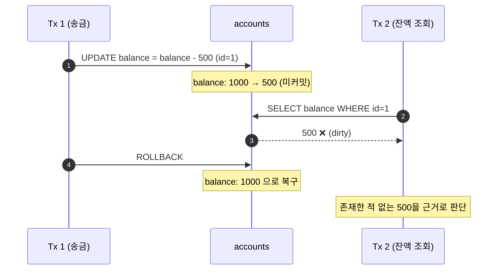
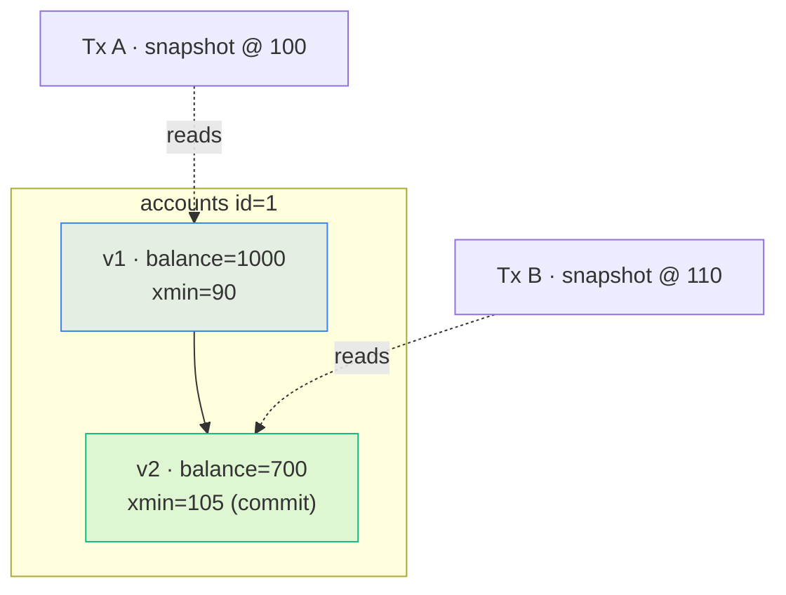

트랜잭션의 **ACID** 중에서 가장 오해가 많은 글자는 **I(Isolation)** 입니다. 완벽한 격리는 곧 "한 번에 하나씩 실행"을 의미하고, 이는 성능을 크게 떨어뜨립니다. 그래서 데이터베이스는 **격리 수준(Isolation Level)** 이라는 손잡이를 제공하고, 우리는 성능과 정확성 사이에서 타협점을 고릅니다.

## 세 가지 이상 현상

SQL 표준은 격리 수준을 "어떤 이상 현상을 허용하는가"로 정의합니다.

### Dirty Read

**커밋되지 않은** 다른 트랜잭션의 변경을 읽는 현상입니다. 그 트랜잭션이 롤백되면, 존재한 적 없는 데이터를 근거로 판단한 셈이 됩니다.



### Non-Repeatable Read

한 트랜잭션 안에서 **같은 행을 두 번 읽었는데 값이 다른** 현상입니다. 중간에 다른 트랜잭션이 그 행을 수정하고 커밋했기 때문입니다.

### Phantom Read

같은 **조건으로 두 번 조회했는데 행의 개수가 달라지는** 현상입니다. 다른 트랜잭션이 조건에 맞는 새 행을 삽입(또는 삭제)했기 때문입니다.

## 격리 수준별 허용 범위

| 격리 수준 | Dirty Read | Non-Repeatable Read | Phantom Read |
| --- | :---: | :---: | :---: |
| READ UNCOMMITTED | 발생 | 발생 | 발생 |
| READ COMMITTED | ✅ 방지 | 발생 | 발생 |
| REPEATABLE READ | ✅ 방지 | ✅ 방지 | 발생 (표준 기준) |
| SERIALIZABLE | ✅ 방지 | ✅ 방지 | ✅ 방지 |

위로 갈수록 동시성이 높고, 아래로 갈수록 정확성이 높습니다. 단, 이 표는 **SQL 표준의 최소 요구 사항** 이라 실제 DBMS 동작은 더 엄격한 경우가 많습니다.

## DBMS별 기본값과 실제 동작

| DBMS | 기본 격리 수준 | 특징 |
| --- | --- | --- |
| Oracle | READ COMMITTED | READ COMMITTED와 SERIALIZABLE만 지원. Undo 기반 MVCC로 읽기가 쓰기를 막지 않음 |
| PostgreSQL | READ COMMITTED | REPEATABLE READ에서도 스냅샷 격리로 Phantom 방지 |
| MySQL (InnoDB) | REPEATABLE READ | Next-Key Lock으로 잠금 읽기 시 Phantom 방지 |
| SQL Server | READ COMMITTED | 기본은 잠금 기반, `READ_COMMITTED_SNAPSHOT` 옵션으로 MVCC |

## 직접 재현해 보기: Non-Repeatable Read

두 개의 SQL 세션을 열어 번갈아 실행해 보세요. 세션 A는 `READ COMMITTED` 입니다.

```sql title="session_a.sql" {3,8}
SET TRANSACTION ISOLATION LEVEL READ COMMITTED;

SELECT balance FROM accounts WHERE id = 1;  -- ① 1000

-- (이 사이에 세션 B가 실행)
--   UPDATE accounts SET balance = 700 WHERE id = 1; COMMIT;

SELECT balance FROM accounts WHERE id = 1;  -- ② 700  ← 값이 바뀌었다
COMMIT;
```

세션 A를 `REPEATABLE READ`(PostgreSQL·MySQL) 또는 `SERIALIZABLE`(Oracle)로 바꾸면 ②에서도 1000이 나옵니다. 트랜잭션이 시작될 때(정확히는 첫 쿼리 시점에) 찍어 둔 **스냅샷** 을 계속 보기 때문입니다.

<SqlResult
  columns={["isolation_level", "read_1", "read_2", "repeatable"]}
  rows={[
    ["READ COMMITTED", 1000, 700, false],
    ["REPEATABLE READ", 1000, 1000, true],
    ["SERIALIZABLE", 1000, 1000, true]
  ]}
  highlight={[1, 2]}
  time="0.011s"
>

```sql title="compare_levels.sql"
-- 각 격리 수준에서 위 시나리오를 실행한 결과 요약
SELECT isolation_level, read_1, read_2, (read_1 = read_2) AS repeatable
FROM isolation_experiment
ORDER BY strength;
```

</SqlResult>

## MVCC: 읽기와 쓰기가 서로 막지 않는 법

현대 DBMS 대부분은 **MVCC(Multi-Version Concurrency Control)** 를 사용합니다. 행을 수정할 때 덮어쓰지 않고 **새 버전을 만들어**, 각 트랜잭션은 자기 스냅샷 시점에 맞는 버전을 읽습니다.



덕분에 `SELECT`는 잠금을 기다리지 않습니다. 대신 오래된 버전을 정리하는 비용이 생기는데, PostgreSQL의 `VACUUM`, Oracle의 Undo 세그먼트 관리가 바로 그것입니다. Oracle에서 긴 조회 중 `ORA-01555: snapshot too old` 가 나는 이유도 필요한 과거 버전이 Undo에서 덮어써졌기 때문입니다.

<Callout type="warn" title="Lost Update는 격리 수준만으로 막히지 않을 수 있다">
"읽고 → 계산하고 → 쓰는" 패턴(예: 재고 차감)은 READ COMMITTED에서 두 트랜잭션이 같은 값을 읽고 각자 덮어써 한 쪽 갱신이 사라질 수 있습니다. `SELECT ... FOR UPDATE` 로 행 잠금을 걸거나, `UPDATE stock SET qty = qty - 1 WHERE qty > 0` 처럼 **원자적 갱신** 으로 작성하세요.
</Callout>

## 정리

- 격리 수준은 **허용하는 이상 현상**으로 정의된다: Dirty → Non-Repeatable → Phantom.
- 기본값은 DBMS마다 다르다: Oracle·PostgreSQL은 READ COMMITTED, MySQL InnoDB는 REPEATABLE READ.
- MVCC 덕분에 읽기는 쓰기를 막지 않지만, 버전 정리 비용과 스냅샷 한계가 있다.
- 동시 갱신은 `FOR UPDATE` 나 원자적 `UPDATE` 로 명시적으로 보호하자.
